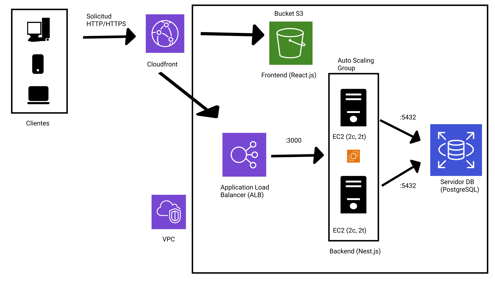
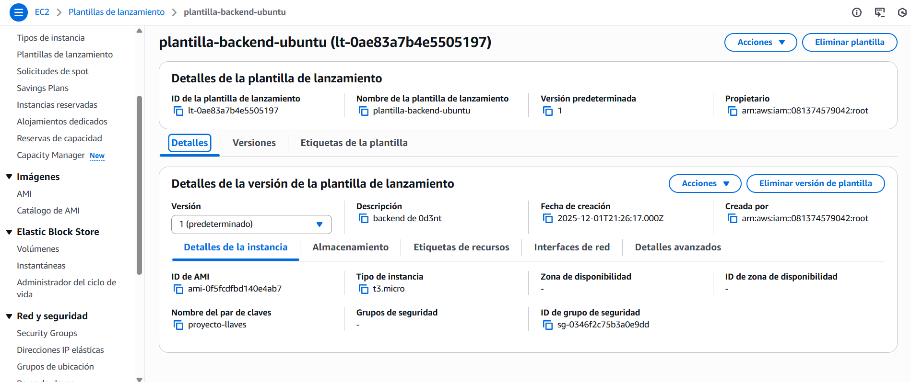
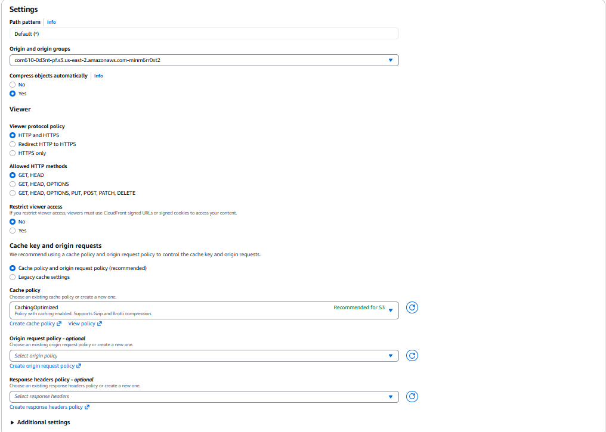

<h1 align="center"> Despliegue de Sistema Clínico Escalable en AWS con Arquitectura Hexagonal y Contenerización </h1>

# 📋 Información del Proyecto

Asignatura: Trabajando en la Nube (COM610)

Docente: Ing. Lucio Marcelo Quispe Ortega

Grupo: 1

Estudiante: Aparicio Llanquipacha Gabriel

Semestre: 2-2025

# 🚀 Descripción del Software

Este proyecto consiste en el despliegue en la nube de una plataforma web para la gestión de una clínica dental. El sistema permite la administración de pacientes, citas y expedientes médicos mediante una interfaz moderna y segura.

A nivel de infraestructura, se ha diseñado una arquitectura Cloud-Native en Amazon Web Services (AWS) que prioriza la Alta Disponibilidad (HA), la Seguridad y la Escalabilidad Automática.

## 🛠 Tech Stack

| Componente        | Tecnología            | Servicio AWS                 |
|------------------|-----------------------|------------------------------|
| **Frontend**     | React.js (Vite)       | S3 + CloudFront              |
| **Backend**      | NestJS (Node.js)      | EC2 + Auto Scaling Group     |
| **Contenerización** | Docker             | ECR / Docker Hub             |
| **Base de Datos** | PostgreSQL           | Amazon RDS                   |
| **Proxy / CDN**  | N/A                   | CloudFront + ALB             |

# ☁️ Arquitectura del Despliegue

La arquitectura implementada sigue el patrón de Proxy Inverso con CDN, unificando tanto el frontend como el backend bajo un único dominio seguro (HTTPS) para evitar problemas de CORS y "Mixed Content".

<div align="center">

</div>

## 🔄 Flujo de Datos

- **Cliente:** El usuario accede vía HTTPS a través de CloudFront.
- **CDN (CloudFront):**
  - Si la petición es contenido estático (JS, CSS), lo sirve desde el Bucket S3.
  - Si la ruta comienza con `/api`, redirige el tráfico al Application Load Balancer (ALB).
- **Balanceo:** El ALB distribuye la carga entre las instancias saludables.
- **Cómputo (Auto Scaling):** Las instancias EC2 (Ubuntu) ejecutan el backend encapsulado en contenedores Docker.
- **Persistencia:** Los contenedores se conectan de forma privada a Amazon RDS.

---

## 🛡️ 1. Estrategia de Seguridad (Security Groups)

Se aplicó estrictamente el principio de **Mínimo Privilegio**.  
Los recursos no son accesibles directamente desde internet, salvo el punto de entrada.

| Grupo de Seguridad | Puerto | Origen Permitido | Descripción |
|--------------------|--------|------------------|-------------|
| **sg-alb-public**  | 80 / 443 | 0.0.0.0/0      | Permite tráfico web público hacia el Balanceador. |
| **sg-backend-ec2** | 3000   | sg-alb-public    | El backend solo acepta peticiones del ALB. |
| **sg-db-rds**      | 5432   | sg-backend-ec2   | La base de datos solo acepta conexiones desde los servidores backend. |

---

## ⚙️ 2. Configuración de Automatización (Infrastructure as Code)

Para garantizar la elasticidad, no se configuran servidores manualmente.  
Se utiliza una **Launch Template** que aprovisiona automáticamente las instancias del Auto Scaling Group.

**Launch Template:**
- **AMI:** Ubuntu Server 24.04 LTS  
- **Instance Type:** t2.micro / t3.micro  
- **IAM Role:** `Rol-EC2-Acceso-S3` (Permite descargar el `.env` de producción).

---

### 📜 Script de User Data (Bootstrapping)

Este script se ejecuta automáticamente al nacer cada instancia.  
Se encarga de **instalar Docker**, **descargar el código** y **levantar el contenedor**.


```bash
exec > >(tee /var/log/user-data.log|logger -t user-data -s 2>/dev/console) 2>&1
echo "--- INICIANDO DESPLIEGUE AUTOMATIZADO ---"
apt-get update -y
apt-get install -y docker.io git curl awscli
systemctl start docker
systemctl enable docker
usermod -aG docker ubuntu
mkdir -p /home/ubuntu/app
cd /home/ubuntu/app
echo "--- CLONANDO REPOSITORIO ---"
git clone [https://github.com/Deus-Ex-Umbra/COM610-0d3nt-backend.git](https://github.com/Deus-Ex-Umbra/COM610-0d3nt-backend.git) .
echo "--- DESCARGANDO CONFIGURACIÓN ---"
wget [http://d3ftme9hh1yrd9.cloudfront.net/.env](http://d3ftme9hh1yrd9.cloudfront.net/.env) -O .env
echo "--- CONSTRUYENDO IMAGEN DOCKER ---"
docker build -t nest-backend .
echo "--- EJECUTANDO CONTENEDOR ---"
docker run -d \
  --restart always \
  --name backend-api \
  -p 3000:3000 \
  --env-file .env \
  nest-backend

echo "--- DESPLIEGUE COMPLETADO ---"
```

<div align="center">

</div>

# 📈 3. Escalabilidad y Auto Scaling Group (ASG)

El sistema es capaz de reaccionar ante picos de demanda.

Configuración ASG:

Mínimo: 2 instancia.

Máximo: 4 instancias.

Política de Escalado (Target Tracking):

Se configuró una alerta de CloudWatch para monitorear el CPU Promedio.

Si el CPU supera el 40%, el sistema añade automáticamente nuevas instancias.

Prueba de Estrés (Resiliencia)

Para validar la elasticidad, se sometió al sistema a una prueba de carga utilizando la herramienta stress.

Comando de ataque:

# Genera carga artificial en 2 núcleos durante 10 minutos
```bash
stress --cpu 2 --timeout 600
```

Resultado: El ASG detectó la carga y lanzó nuevas instancias automáticamente sin intervención humana.

## 🌐 4. CloudFront como Proxy Inverso (Solución CORS / SSL)

Uno de los mayores desafíos fue la integración segura entre el Frontend (HTTPS) y el Backend.  
La solución fue configurar **CloudFront como punto de entrada único**, actuando como *reverse proxy*.

### 🔧 Configuración de Behaviors

- **Ruta Default (`*`)**: Sirve el Frontend (React) desde el Bucket S3.  
- **Ruta API (`/api/*`)**: Redirige el tráfico al Application Load Balancer.

Esto permite que el navegador interprete **todo el tráfico como local y seguro**, eliminando problemas de CORS y asegurando compatibilidad SSL end-to-end.

### 🏗️ Configuración en Origins

- **Origin S3:** Acceso restringido mediante **OAC (Origin Access Control)**.  
- **Origin ALB:** Conexión interna vía **HTTP (Puerto 80)** dentro de AWS (no expuesto a internet).

<div align="center">

</div>

---

## 💻 5. Despliegue del Frontend

El frontend se construyó localmente y se desplegó como sitio estático en S3.

### 📦 Archivo `.env` de React

Gracias a la configuración del proxy, la API utiliza el **mismo dominio del CDN**:

VITE_API_URL=[https://d3ftme9hh1yrd9.cloudfront.net](https://d3ftme9hh1yrd9.cloudfront.net)

---

## ✅ Conclusiones

Este despliegue demuestra cómo una arquitectura moderna en AWS resuelve problemas tradicionales de infraestructura:

- **Costo-Efectividad:** Solo se pagan las instancias activas gracias al Auto Scaling.  
- **Seguridad:** El backend y la base de datos están completamente aislados de internet.  
- **Experiencia de Usuario:** CloudFront distribuye el contenido desde su CDN global, reduciendo la latencia y acelerando la carga.

